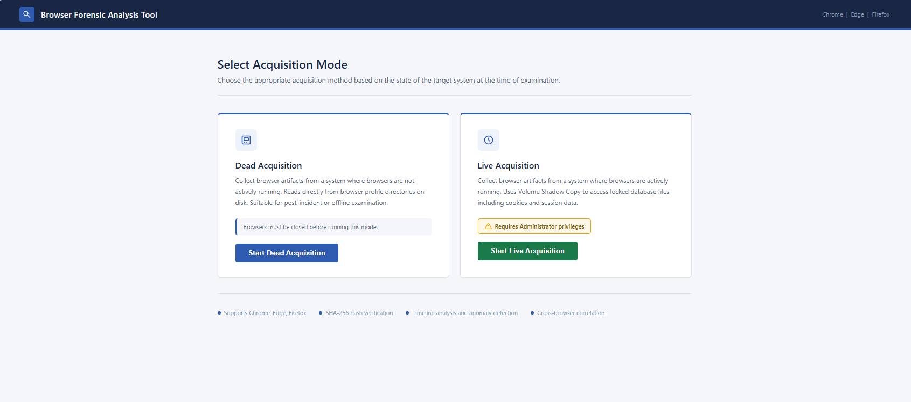
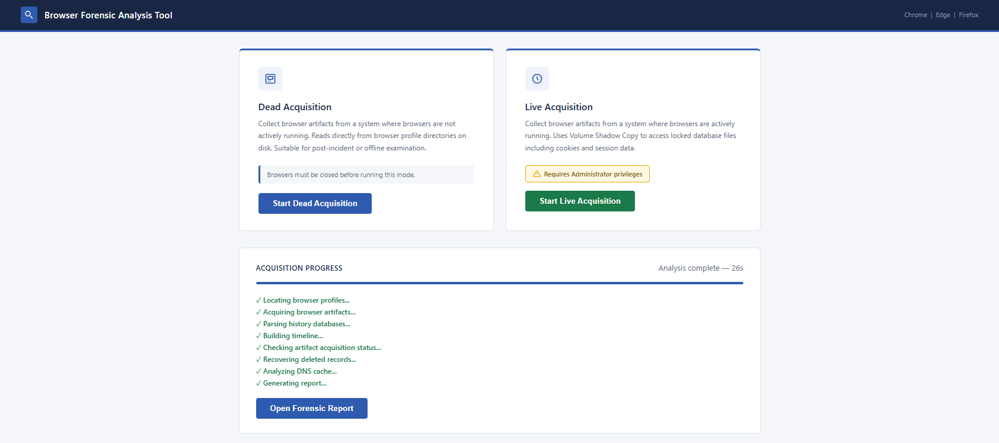
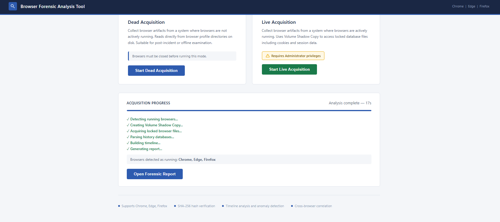
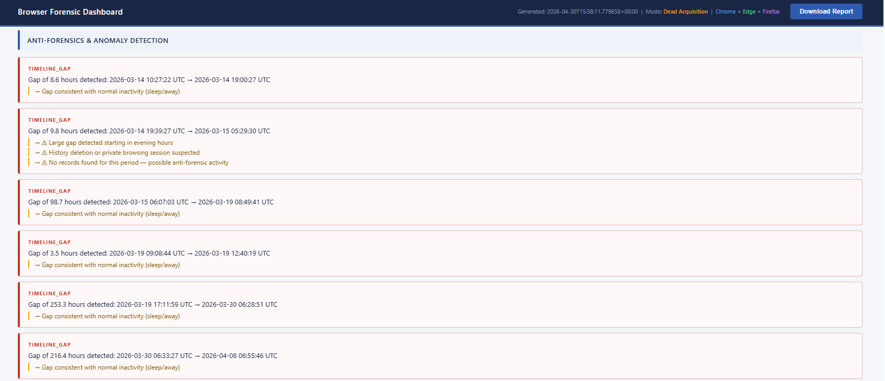
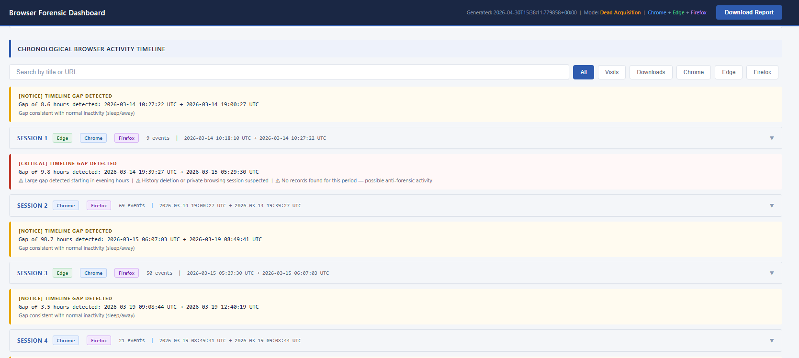
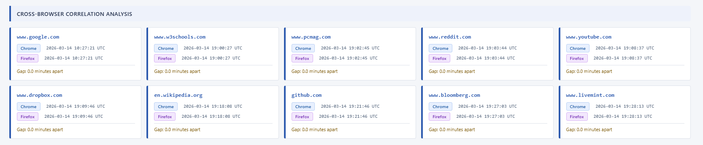
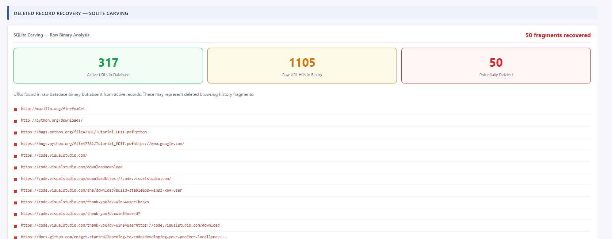
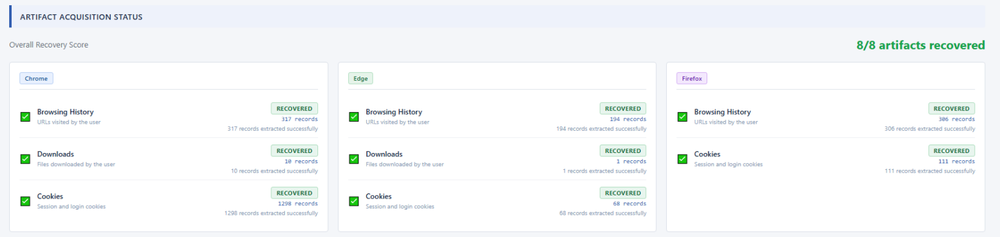
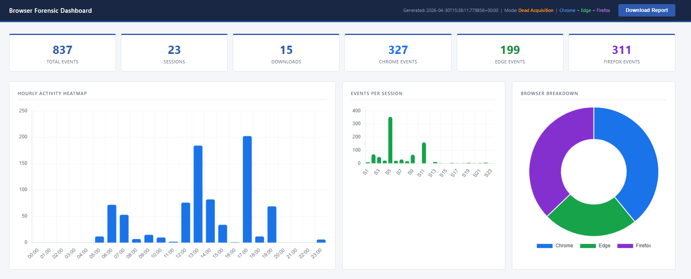
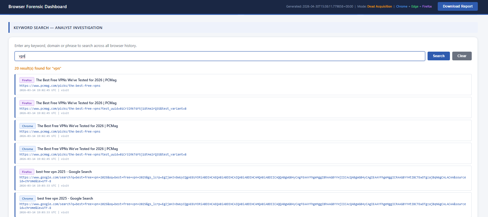

# Automated Multi-Browser Forensic Analysis Tool

A Python-based browser forensic analysis tool designed for digital investigations across Google Chrome, Microsoft Edge, and Mozilla Firefox.

## Features
- Multi-browser artifact acquisition
- Live and dead acquisition support
- SHA-256 hash verification
- Unified timeline reconstruction
- Anti-forensics detection
- Deleted history recovery using SQLite carving
- DNS cache analysis
- Cross-browser correlation analysis
- Chain of custody generation
- Interactive forensic dashboard
- Automated forensic report generation

---

## Supported Browsers
- Google Chrome
- Microsoft Edge
- Mozilla Firefox

---

## Technologies Used
- Python
- SQLite
- HTML
- CSS
- JavaScript
- Windows Volume Shadow Copy Service (VSS)

---

## Project Structure

```bash
acquisition.py          # Dead acquisition
live_acquisition.py    # Live acquisition using VSS
parser.py              # SQLite artifact extraction
timeline.py            # Timeline and session analysis
recover_deleted.py     # Deleted record recovery
dns_parser.py          # DNS cache analysis
artifact_health.py     # Artifact validation
dashboard.py           # Interactive dashboard generation
chain_of_custody.py   # Chain of custody generation
app.py                 # Main application server
```

---

## Installation

```bash
pip install -r requirements.txt
```

---

## Run the Tool

```bash
python app.py
```

Open in browser:

```bash
http://localhost:5000
```

---

## Features Demonstrated

### Live and Dead Acquisition
- Supports acquisition from both running and closed browsers
- Uses Windows VSS for locked browser databases

### Timeline Reconstruction
- Builds a unified browser activity timeline
- Performs session segmentation and gap analysis

### Anti-Forensics Detection
- Detects suspicious browsing gaps
- Identifies possible private browsing or history deletion

### Deleted Record Recovery
- Recovers potentially deleted URLs using SQLite carving

### DNS Cache Analysis
- Compares DNS cache with browser history
- Detects domains not present in browser records

### Chain of Custody
- Generates forensic logs with SHA-256 integrity hashes

---

## Screenshots

### Dashboard


### Dead Acquisition


### Live Acquisition


### Anti-Forensics Detection


### Browser Activity Timeline


### Cross Browser Correlation


### Deleted Record Recovery


### Artifact Recovery Status


### Generated Output


### Keyword Search


---

## Disclaimer
This project was developed for academic and educational purposes in the field of digital forensics and cybersecurity.

---

## Author
Shreyanshi Dixit
